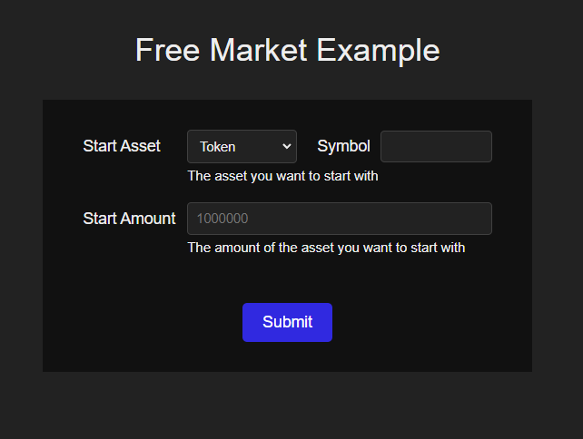

# Free Market Arguments UI Example App

## TODO

How to handle uniqueId? (it's not in the code sample, required in typescript)

```
    void initializeFunAccount({
      users: [{ userId: convertToValidUserId(connectorAccount) }],
      index: Math.floor(Math.random() * 10000000),
      uniqueId: 'foo',
    }).catch()
```

When should this be calling funwallet.getDeploymentStatus?

## Overview

This package shows how to host WorkflowArgumentsForm, a react component that collects argument values for workflows from users.

## Workflow Parameters Example

Consider the following App, which defined a Free Market workflow and passes it to the WorkflowArgumentsForm:

```ts
import React from 'react'
import './dark-mode.css'
import './App.css'

import { WorkflowArgumentsForm } from '@freemarket/args-ui-react'
import { Workflow } from '@freemarket/client-sdk'

const workflow: Workflow = {
  steps: [
    {
      type: 'uniswap-exact-in',
      inputAsset: '{{ startAsset }}',
      inputAmount: '{{ startAmount }}',
      outputAsset: {
        type: 'fungible-token',
        symbol: 'USDC',
      },
      inputAssetSource: 'caller',
    },
  ],
  parameters: [
    {
      name: 'startAsset',
      label: 'Start Asset',
      description: 'The asset you want to start with',
      type: 'asset-ref',
    },
    {
      name: 'startAmount',
      label: 'Start Amount',
      description: 'The amount of the asset you want to start with',
      type: 'amount',
    },
  ],
}

export default function App() {
  return (
    <div className="App">
      <div style={{ display: 'flex', flexDirection: 'column', alignItems: 'center', margin: 30, padding: 40 }}>
        <h1>Free Market Example</h1>
        <WorkflowArgumentsForm workflow={workflow} onSubmit={args => console.log(args)} />
      </div>
    </div>
  )
}
```

WorkflowArgumentsForm's job is to render a form based on the `parameters` metadata in the workflow.  
Once a valid set of form data has been submitted by the user, the onSubmit handler is called with the argument values.

The above workflow results in this form:


